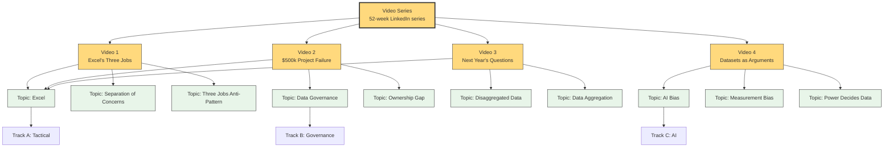
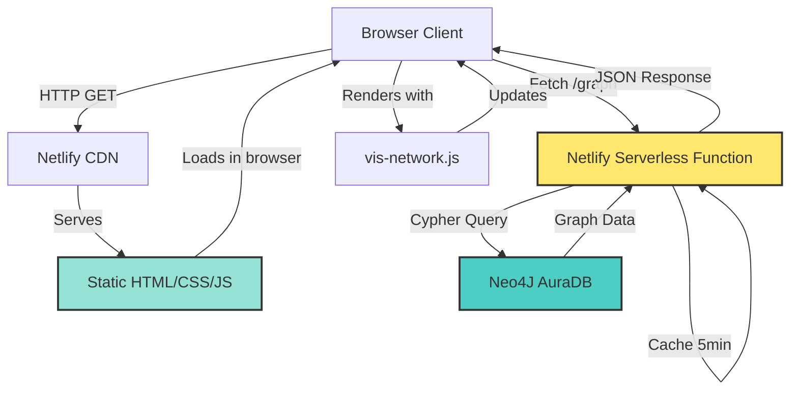

# Data in the Real World - Knowledge Graph Visualization

**Live Site:** https://data-in-real-world-graph.netlify.app  
**GitHub:** https://github.com/DataStrategist/data-in-real-world-graph

Interactive knowledge graph visualization for the "Data in the Real World" 52-week LinkedIn video series. Each video explores data management concepts, organizational dysfunction, and AI strategy - this graph maps how they all connect.

---

## Concept

**How it works:**
- **Videos** (yellow nodes) cover specific data management scenarios
- **Topics** (green nodes) are reusable concepts that appear across multiple videos
- **Tracks** organize topics by level: A = Tactical, B = Governance, C = AI
- **Relationships** show which topics each video discusses
- **The graph reveals patterns**: Excel appears in 3 videos, governance issues connect to AI bias, tactical problems cascade into strategic failures

---

## Architecture

### Frontend (`index.html`)
- Single-page application using [vis-network](https://visjs.github.io/vis-network/)
- Interactive graph with hover tooltips, click-to-highlight
- Mobile-responsive (emoji-only buttons, scrollable modal)
- Search dropdown for finding specific nodes
- Yellow "🔗 View Video" button appears when clicking Video nodes

### Backend (`netlify/functions/graph.js`)
- Serverless function runs on Netlify
- Connects to Neo4J AuraDB (credentials in environment variables)
- Query: `MATCH (n) OPTIONAL MATCH (n)-[r]-(m) RETURN n, r, m LIMIT 1200`
- 5-minute cache to reduce database load
- Returns JSON formatted for vis-network

### Security
- ✅ Neo4J credentials never exposed to browser
- ✅ Read-only queries only
- ✅ Rate limiting via caching
- ✅ Bounded queries (max 1200 rows)

---

## Neo4J Schema

### Node Types
- **VideoSeries**: The overarching 52-week series
- **Video**: Individual published episodes with LinkedIn URLs, metrics
- **Topic**: Concepts, problems, principles discussed in videos
- **Track**: Content categories (A/B/C for tactical/governance/AI)

### Relationships
- `part_of`: Videos belong to series, topics belong to tracks
- `discusses`: Videos discuss topics
- `related_to`: Topics connect to other topics

### Properties

**Video nodes:**
- `number`: Episode number (1-4 published so far)
- `name`: Video title
- `linkedin_url`: Link to LinkedIn post
- `published_date`: YYYY-MM-DD
- `track`: A, B, or C
- `impressions_7day`, `reach_7day`, `reactions_7day`, `comments_7day`: Engagement metrics

**Topic nodes:**
- `name`: Concept name ("Excel", "Data Governance", "AI Bias")
- `category`: Type (Tool, Concept, Problem, Principle, etc.)
- `description`: Explanation of the concept

---

## Tech Stack

- **Graph Database**: Neo4J AuraDB (free tier)
- **Backend**: Node.js serverless function on Netlify
- **Frontend**: Vanilla JS + vis-network.js
- **Hosting**: Netlify (free tier)
- **Analytics**: Google Analytics 4
- **Source Control**: GitHub

---

## Credits

Built by Amit Kohli as part of the "Data in the Real World" LinkedIn series.  
**Connect:** [LinkedIn](https://www.linkedin.com/in/amitkohli1/) • [Website](https://amitkohli.com)  
**Series Overview:** 52-week exploration of data management, organizational dysfunction, and AI strategy in social care.
