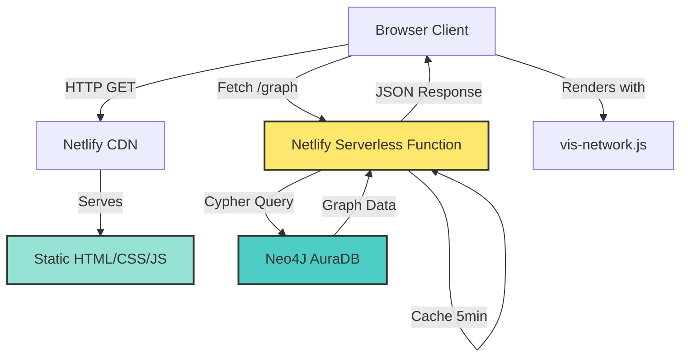

# Neo4j Knowledge Graph Visualization

**Live Site:** https://data-in-real-world-graph.netlify.app

A public, read-only visualization of the "Data in the Real World" LinkedIn video series knowledge graph. Shows videos, topics, and their interconnections without exposing Neo4J credentials.

## Architecture



## How It Works

### Frontend (`index.html`)
- Single-page application using [vis-network](https://visjs.github.io/vis-network/) for interactive graph rendering
- Fetches graph data from serverless backend
- Provides controls: fit to screen, toggle physics, reload
- Hover nodes/edges to see details

### Backend (`netlify/functions/graph.js`)
- Serverless function runs on Netlify's infrastructure
- Connects to Neo4J AuraDB using credentials stored as environment variables (never exposed to client)
- Executes bounded Cypher query: `MATCH (n) WITH n LIMIT 200 OPTIONAL MATCH (n)-[r]-() RETURN n, r LIMIT 1200`
- Caches results for 5 minutes to reduce database load
- Returns JSON with nodes and edges formatted for vis-network

### Security
- ✅ Neo4J credentials never sent to browser
- ✅ Read-only queries (no WRITE operations)
- ✅ Rate limiting via caching
- ✅ Bounded queries prevent DoS

## Deployment

### Prerequisites
- Neo4J AuraDB instance (or any Neo4J database)
- Netlify account
- GitHub repository

### Setup Steps

1. **Fork/clone this repository**

2. **Set environment variables in Netlify:**
   ```
   NEO4J_URI=neo4j+s://your-instance.databases.neo4j.io
   NEO4J_USER=your-username
   NEO4J_PASSWORD=your-password
   NEO4J_DATABASE=neo4j
   ```

   Optional tuning:
   ```
   NODE_LIMIT=200        # Max nodes to fetch (default 200, max 300)
   ROW_LIMIT=1200        # Max query rows (default 1200, max 2000)
   CACHE_SECONDS=300     # Cache duration (default 300, min 30)
   ```

3. **Deploy to Netlify:**
   - Connect your GitHub repo in Netlify dashboard
   - Netlify auto-detects build settings from `netlify.toml`
   - Site deploys automatically on `git push`

### Local Development

```bash
npm install
cp .env.example .env      # Fill in your Neo4J credentials
netlify dev               # Runs local server with function emulation
```

## Graph Schema

Current graph contains:
- **Video nodes**: LinkedIn video posts with metrics (impressions, reactions, reach)
- **Topic nodes**: Concepts covered (Excel, Data Governance, AI Bias, etc.)
- **Track nodes**: Content categories (A: Tactical, B: Systems, C: AI)
- **VideoSeries node**: Metadata about the 52-week series

Relationships:
- `Video -[:COVERS]-> Topic`: Videos cover specific topics
- `Video -[:PART_OF]-> VideoSeries`: Videos belong to series
- `Video -[:IN_TRACK]-> Track`: Videos assigned to content tracks
- `Topic -[various]-> Topic`: Semantic connections (LEADS_TO, CAUSES, MITIGATES, etc.)

## Customization

### Visual Styling

Edit `index.html` to change node colors, sizes, or layout:
```javascript
const options = {
  nodes: { 
    shape: 'box',              // Change to 'ellipse', 'circle', 'database', etc.
    widthConstraint: { maximum: 200 }
  },
  physics: { enabled: true }    // Toggle physics simulation
};
```

### Query Modification

Edit `netlify/functions/graph.js` to change what data is fetched:
```javascript
const cypher = `
  MATCH (v:Video)-[:COVERS]->(t:Topic)  // Only videos and topics
  RETURN v, t
`;
```

## Credits

- Graph visualization: [vis-network](https://visjs.github.io/vis-network/)
- Database: [Neo4J](https://neo4j.com/)
- Hosting: [Netlify](https://www.netlify.com/)
- Knowledge graph data: "Data in the Real World" LinkedIn video series
